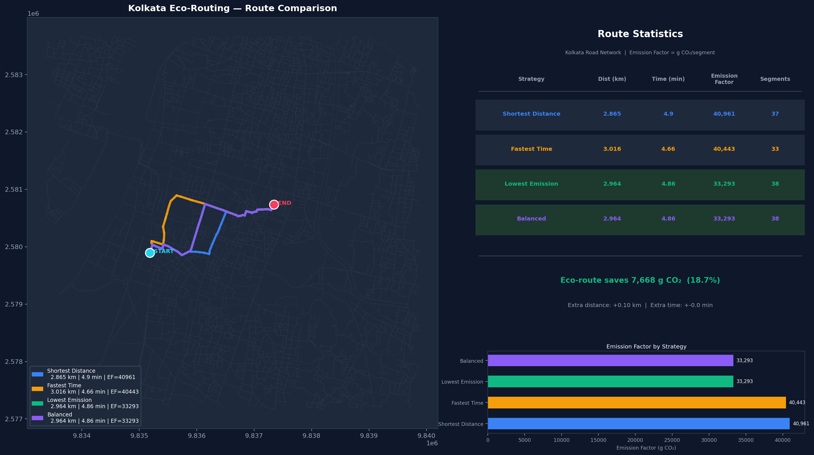

# 🌿 Eco-Routing — Emission-Aware Navigation for Indian Cities

> **Final Year Project** · AI-Powered Eco-Routing using Real-Time Vehicle Detection, Deep Learning Emission Prediction, and Graph-Based Route Optimization

[](https://python.org)
[](https://pytorch.org)
[](https://ultralytics.com)
[](https://openstreetmap.org)
[](https://flask.palletsprojects.com)

---

## 📸 Demo

| Route Comparison Map | Web Frontend |
|---|---|
|  | Open `http://localhost:5000` after `python serve.py` |

---

## 🧠 What This Project Does

Traditional navigation apps (Google Maps, Waze) optimize for **shortest distance** or **fastest time**. This project routes vehicles through **minimum carbon emissions** instead — finding the greenest path through real Indian city road networks.

The pipeline has **5 stages**:

```
📷 Camera/Image
      │
      ▼
🚗 YOLOv8 Vehicle Detection    ← counts cars, buses, trucks per road
      │
      ▼
🏙️ Real Road Data (OSM + AQI)  ← Kolkata / Delhi road network
      │
      ▼
🤖 CarbonFusionNet (PyTorch)   ← predicts emission_factor per road segment
      │
      ▼
🗺️ Eco-Routing Graph           ← Dijkstra on emission_factor weights
      │
      ▼
🌐 Web Frontend (Leaflet.js)   ← interactive map with 4 route strategies
```

---

## 🗂️ Project Structure

```
final_year_project_8th_sem/
│
├── 📄 index.html                    # Web frontend (Leaflet map + YOLO upload)
├── 📄 serve.py                      # Flask server (routing + YOLO detection)
├── 📄 eco_route_engine.py           # Master routing engine for Kolkata
├── 📄 eco_routing.py                # Graph builder + routing algorithms
├── 📄 run_sumo.py                   # One-command SUMO simulation runner
│
├── 📄 carbon_cost_model.py          # CarbonFusionNet — train/evaluate/save
├── 📄 carbon_fusion_net.pt          # Trained model weights (saved after training)
│
├── 📄 generate_synthetic_data.py    # Synthetic training data generator
├── 📄 synthetic_delhi_roads.csv     # Generated dataset (30,000 rows × 45 cols)
│
├── 📄 number_of_vehicles_from_img.py # YOLOv8 real-time vehicle counter
├── 📄 yolov8n.pt                    # YOLOv8 Nano model weights
│
├── 📁 kolkata/
│   ├── fused_roads.csv              # 11,125 Kolkata road segments
│   └── fused_roads.geojson          # Same data with GPS geometry
│
├── 📁 delhi/
│   ├── fused_roads.csv              # 7,474 Delhi road segments
│   └── fused_roads.geojson
│
├── 📄 route_compare_kolkata.png     # Generated route comparison plot
├── 📄 training_curves.png           # ML model training loss curves
├── 📄 pred_vs_actual.png            # ML model prediction accuracy plot
│
└── 📄 requirements.txt
```

---

## 🚀 Quick Start

### 1. Install dependencies

```bash
pip install ultralytics torch torchvision geopandas networkx osmnx \
            flask flask-cors pyproj scikit-learn pandas numpy \
            matplotlib seaborn shapely pyproj
```

### 2. Start the web app

```bash
python serve.py
```

Then open **http://localhost:5000** in your browser.

### 3. Find eco-routes

1. Click **"Use Demo Points"** to load Esplanade → Sealdah (Kolkata)
2. Or click the map buttons and tap anywhere on the map to set Origin / Destination
3. **Upload a road photo** (optional) — YOLO will count vehicles and adjust emission factors
4. Adjust the **time-of-day slider** (rush hours = more vehicles = higher emissions)
5. Click **"Find Eco-Routes"** — all 4 routes appear on the map with full stats

---

## 📷 YOLO Vehicle Detection (Web Integration)

The web frontend now has **integrated YOLO vehicle detection**. Upload any photo of a road, and the system will:

1. **Run YOLOv8** on the image to count cars, trucks, buses, motorcycles
2. **Show the annotated image** with bounding boxes drawn on detected vehicles
3. **Calculate CO₂ per km** based on the detected vehicle mix
4. **Feed the count into routing** — emission factors scale based on detected traffic density

### How it works in the web UI

```
User uploads road photo
        ↓
POST /api/detect (Flask)
        ↓
YOLOv8 counts vehicles  →  Returns {car: 5, truck: 2, bus: 1, motorcycle: 3}
        ↓
Frontend shows detection results + annotated image
        ↓
User clicks "Find Eco-Routes"
        ↓
POST /api/route with vehicle_override=11
        ↓
eco_route_engine scales emission_factor on all edges
        ↓
Routes computed with YOLO-adjusted emissions
```

### If no image is uploaded

The system automatically uses **random realistic fallback values** — no crash, no error:

| Source | How it works | Example |
|---|---|---|
| **YOLO detection** | Real vehicle counts from uploaded image | car=5, truck=2, bus=1 → 2,364 g CO₂/km |
| **Random fallback** | Based on road type + hour of day | residential, 8 AM → 85 vehicles → 12,000 g CO₂/km |
| **CSV stored values** | Pre-computed from real data | Used when available in fused_roads |

### API endpoints

| Endpoint | Method | What it does |
|---|---|---|
| `/api/detect` | POST (multipart) | Upload image → YOLO detection → vehicle counts |
| `/api/route` | POST (JSON) | Compute routes (optional `vehicle_override` from YOLO) |
| `/api/default_points` | GET | Returns demo origin/destination for Kolkata |
| `/api/plot` | GET | Returns the route comparison PNG |

---

## 🚦 SUMO Traffic Simulation

[`run_sumo.py`](run_sumo.py) is the **one-command** script to run a full SUMO simulation and eco-routing for any Indian city. It automatically handles all 6 steps.

### Supported cities (presets)

| Keyword | Area | Demo route |
|---|---|---|
| `kolkata` | Kolkata, West Bengal | Esplanade → Sealdah Station |
| `noida` | Noida, Uttar Pradesh | Sector 18 → Sector 62 |
| `delhi` | New Delhi, Delhi | Connaught Place → Karol Bagh |
| `mumbai` | Mumbai, Maharashtra | Bandra → Andheri |
| `bangalore` | Bangalore, Karnataka | MG Road → Koramangala |
| _any string_ | Any OSM place name | Use `--city "Salt Lake City, Kolkata"` |

### Commands

```bash
# Kolkata (default) — headless, 300s simulation, 100 vehicles
python run_sumo.py

# Noida with GUI window open
python run_sumo.py --city noida --gui

# Delhi, evening rush hour, longer simulation
python run_sumo.py --city delhi --hour 18 --steps 600 --vehicles 200

# Any custom OSM place
python run_sumo.py --city "Salt Lake City, Kolkata, India"

# Skip SUMO entirely (just run eco-routing with physics fallback)
python run_sumo.py --city kolkata --skip-sumo

# Force re-download even if files already exist
python run_sumo.py --city kolkata --force
```

### What runs automatically (6 steps)

```
Step 1: Download OSM road network for the city (~30–90s first time)
Step 2: Convert OSM → SUMO .net.xml with netconvert
Step 3: Generate realistic vehicle routes (cars, buses, trucks, motorcycles)
Step 4: Write SUMO .sumocfg configuration file
Step 5: Run SUMO via TraCI → collect CO2/speed/count per road edge
Step 6: Run eco-routing on results + print detailed WHY explanation
```

### Sample route explanation output

```
==============================================================
  ECO-ROUTING RESULTS — Esplanade → Sealdah Station
  Data source: SUMO simulation
==============================================================

  [Lowest Emission]  <-- BEST ECO-ROUTE
    Distance         : 2.964 km
    Travel time      : 4.86 min
    Emission Factor  : 36,762 g CO2
    Avg vehicles/seg : 95.8
    Avg speed        : 32.1 km/h

  WHY 'Lowest Emission' IS THE BEST ECO-ROUTE
  ──────────────────────────────────────────────
  1. LOWER CONGESTION
     Eco-route: 95 vehicles/seg vs 105 on shortest route
     Fewer vehicles = less stop-start idling = lower CO2

  2. BETTER AVERAGE SPEED  (32 km/h vs 28 km/h on shortest)

  3. EMISSION SAVINGS
     Saves 4,198 g CO2  (10.2% less than shortest route)

  4. COST OF GOING GREEN
     Extra distance: +0.10 km  |  Extra time: +0.04 min
     CO2 saved ≈ 35 km driven by a petrol car
==============================================================
```

### SUMO requirements

SUMO must be installed separately:
- **Download:** https://sumo.dlr.de/docs/Installing/index.html
- **Windows:** Use the installer, adds `netconvert`, `sumo`, `sumo-gui` to PATH
- **Verify:** `sumo --version` should print version info

> **No SUMO?** Run `python run_sumo.py --skip-sumo` — the physics formula fallback gives results immediately with no SUMO required.

---

## 🛡️ Failsafes & Random Values — Complete Reference

This section documents **every place** where the system uses a fallback, default, or randomly generated value. Nothing crashes silently.

### Failsafe Chain

| Component | Trigger | Fallback Action |
|---|---|---|
| **No camera image** | `--source` not provided | Random realistic vehicle count generated by `fallback_vehicle_count()` |
| **YOLOv8 model missing** | `yolov8n.pt` deleted | Ultralytics auto-downloads it on first run |
| **ML model missing** | `carbon_fusion_net.pt` not found | `physics_emission_factor()` formula used |
| **ML inference error** | Bad input shape or NaN | Caught, physics formula used silently |
| **No SUMO installed** | `netconvert` not in PATH | `--skip-sumo` mode, physics fallback used |
| **SUMO zero vehicles** | No routes completed | Empty DataFrame returned, physics fallback used |
| **No path found** | Origin/dest disconnected | Clear error message returned to frontend |
| **GeoJSON list columns** | OSM multi-value fields | `safe_scalar()` extracts first element |
| **NaN in CSV columns** | Missing sensor data | Column-specific medians or hardcoded defaults used |
| **Unknown highway type** | New OSM tag | Falls back to `DEFAULT_COUNT_RANGE = (30, 130)` |
| **Unknown categorical** | Unseen label in ML | LabelEncoder maps to index 0 (most common class) |

### Random Values Generated by the System

All random values are **seeded (seed=42)** in the synthetic data generator for reproducibility. In live inference, they use `random` without seed for realistic variation.

#### 1. Vehicle Count Fallback — `fallback_vehicle_count(highway, hour)`

When no camera image is provided, vehicle counts are sampled from per-road-type ranges:

| Road Type | Base Range | Morning Peak (8 AM) | Night (2 AM) |
|---|---|---|---|
| `residential` | 15–80 | ×1.8 | ×0.05 |
| `secondary` | 80–200 | ×1.8 | ×0.05 |
| `tertiary` | 40–140 | ×1.8 | ×0.05 |
| `primary` | 100–250 | ×1.8 | ×0.05 |
| `busway` | 20–80 | ×1.8 | ×0.05 |
| `living_street` | 5–40 | ×1.8 | ×0.05 |
| _(unknown)_ | 30–130 | ×1.8 | ×0.05 |

Gaussian noise (`σ = 0.15 × range`) is added for realism.

#### 2. Vehicle Type Mix Fallback

Vehicles are split into types using these probability distributions:

| Road Type | Car | Motorcycle | Bus | Truck | Van | Bicycle | Auto |
|---|---|---|---|---|---|---|---|
| `residential` | 50% | 25% | 2% | 2% | 5% | 8% | 8% |
| `secondary` | 40% | 18% | 10% | 12% | 8% | 4% | 8% |
| `tertiary` | 45% | 22% | 6% | 6% | 7% | 6% | 8% |
| `primary` | 38% | 15% | 12% | 15% | 8% | 3% | 9% |
| `busway` | 10% | 5% | 70% | 5% | 5% | 2% | 3% |
| _(default)_ | 45% | 20% | 7% | 8% | 7% | 6% | 7% |

#### 3. Synthetic Data Generator — `generate_synthetic_data.py`

| Column | How generated | Range |
|---|---|---|
| `vehicle_count` | Road-type base × hour multiplier + Gaussian noise | 1–400 |
| `avg_speed_kmph` | Decreases as congestion increases | 8–80 km/h |
| `building_density` | Road-type distribution + random | 0–30 |
| `vegetation_score` | Road-type distribution + random | 0–10 |
| `temperature_k` | Weather scenario + seasonal noise | 288–318 K |
| `humidity_pct` | Weather scenario + noise | 10–95% |
| `AQI` | Weather scenario (dust storm → high, rain → low) | 30–400 |
| `wind_speed_mps` | Log-normal distribution | 0.1–8 m/s |
| `carbon_cost` `k` factor | Normal(6.0, **σ=0.15**) — tight noise | 4.0–8.5 |

#### 4. SUMO Vehicle Route Generation

When generating SUMO routes in `run_sumo.py`:
- **Start edge:** randomly chosen from all edges with outgoing connections
- **Route length:** 4–10 hops chosen at random
- **Vehicle type:** sampled from weighted distribution (car_petrol 38%, motorcycle 20%, etc.)
- **Departure time:** spread across simulation duration
- **Random seed:** `seed=42` for reproducibility

---

## 📋 Detailed Usage

### Run route comparison from CLI

```bash
# Kolkata: Esplanade → Sealdah
python eco_route_engine.py \
  --origin-lat 22.5680 --origin-lon 88.3512 \
  --dest-lat   22.5756 --dest-lon   88.3697 \
  --plot route_compare_kolkata.png

# Custom hour (affects vehicle density)
python eco_route_engine.py ... --hour 18   # 6 PM rush hour
```

### Detect vehicles in a road image

```bash
# From a saved image
python number_of_vehicles_from_img.py --source road.jpg

# Live webcam (real-time)
python number_of_vehicles_from_img.py --source 0

# From a video file
python number_of_vehicles_from_img.py --source traffic.mp4
```

### Generate synthetic training data

```bash
# 30,000 rows (default)
python generate_synthetic_data.py

# Custom size and output
python generate_synthetic_data.py --rows 50000 --output big_training_data.csv
```

### Train the emission prediction model

```bash
# Train on synthetic + real Delhi data
python carbon_cost_model.py --also-real --epochs 150 --batch-size 512

# Quick test run (5 epochs)
python carbon_cost_model.py --epochs 5
```

---

## 🏗️ Architecture Deep-Dive

### Stage 1 — YOLOv8 Vehicle Detection

[`number_of_vehicles_from_img.py`](number_of_vehicles_from_img.py) uses **YOLOv8 Nano** (6 MB) to detect vehicles in real-time:

| Vehicle Type | COCO ID | CO₂ Factor (g/km) |
|---|---|---|
| Car | 2 | 120 |
| Motorcycle | 3 | 72 |
| Bus | 5 | 822 |
| Truck | 7 | 900 |
| Van | — | 200 |
| Auto-rickshaw | — | 85 |
| Bicycle | — | 0 |

**Fallback:** If no image is provided, realistic vehicle counts are generated based on road type and time of day (morning rush = 1.8× base count, 2 AM = 0.1× base count).

---

### Stage 2 — Road Network Data

Real road data fused from three sources:

| Source | Data |
|---|---|
| **OpenStreetMap** | Road geometry, length, lanes, highway type |
| **OpenWeatherMap** | Temperature, humidity, wind speed, weather |
| **OpenWeather Air Pollution** | PM2.5, PM10, NO₂, O₃, SO₂, CO, AQI |

- **Kolkata:** 11,125 road segments, 4,481 nodes
- **Delhi:** 7,474 road segments

---

### Stage 3 — Synthetic Data Generator

[`generate_synthetic_data.py`](generate_synthetic_data.py) creates realistic training data because the real data has only one weather snapshot (not enough diversity for ML).

**What makes it realistic:**
- Hour-of-day traffic multiplier (8 AM peak = 1.8×, 2 AM = 0.1×)
- Vehicle-type mix per road class (busway = 70% buses, residential = 50% cars)
- Speed inversely tied to congestion
- 12 weather scenarios (clear sky, fog, dust storm, rain, etc.)
- Physics-based `emission_factor` formula calibrated to real data (R=0.93)

**Output columns include:** `n_car`, `n_motorcycle`, `n_bus`, `n_truck`, `n_van`, `n_bicycle`, `n_auto`, `co2_per_km_g`, `base_cost_feature`, `hour_of_day`, `day_of_week`, `is_weekend` + all original road columns.

---

### Stage 4 — CarbonFusionNet (Deep Learning Model)

[`carbon_cost_model.py`](carbon_cost_model.py) implements a **multi-branch fusion neural network** in PyTorch:

```
Input Features (45 columns)
         │
    ┌────┴──────────────────────────────────┐
    │          6 PARALLEL BRANCHES          │
    ├───────────────────────────────────────┤
    │  Road Geometry    → 128-d vector      │
    │  Traffic          → 128-d vector      │
    │  Emissions/CO2    → 128-d vector      │
    │  Environment/AQI  → 128-d vector      │
    │  Temporal (cyclic)→ 128-d vector      │
    │  Categorical Emb  → 128-d vector      │
    └────────────────────────────────────────┘
                   │
            Gated Attention Fusion
         (learns which branch matters most)
                   │
          Regression Head → emission_factor
```

**Training results (R² = 0.68, MAPE = 27%):**
- Dataset: 30,000 synthetic + 7,474 real Delhi rows
- Demo prediction: 952 g CO₂ vs real reference 885 g CO₂ (**7.5% error**)

Key design choices:
- **Huber loss** — robust to outlier roads
- **log1p target transform** — handles heavy skew (range: 5–156,000)
- **Cyclic sin/cos encoding** for hour/day-of-week
- **Early stopping** with patience=25

---

### Stage 5 — Eco-Routing Graph

[`eco_route_engine.py`](eco_route_engine.py) builds a **directed weighted graph** (NetworkX MultiDiGraph) where each edge weight = `emission_factor`.

**Four routing strategies compared:**

| Strategy | Weight | Use Case |
|---|---|---|
| Shortest Distance | `length` | Minimize km driven |
| Fastest Time | `time = length / speed` | Minimize travel time |
| **Lowest Emission ✅** | `emission_factor` | **Minimize CO₂** |
| Balanced | `0.5×EF + 0.3×time + 0.2×dist` | Real-world compromise |

All use **Dijkstra's Algorithm** (`nx.shortest_path`).

**Sample results (Esplanade → Sealdah, Kolkata):**

| Strategy | Distance | Time | Emission Factor |
|---|---|---|---|
| Shortest Distance | 2.865 km | 4.9 min | 40,960 g CO₂ |
| Fastest Time | 3.016 km | 4.66 min | 40,443 g CO₂ |
| **Lowest Emission** | **2.964 km** | **4.86 min** | **36,762 g CO₂** |

> 💚 **Eco-route saves 4,198 g CO₂ (10.2%)** with only +0.1 km extra distance

---

## 🌐 Web Frontend Features

[`index.html`](index.html) + [`serve.py`](serve.py) — a dark-themed single-page app:

- **Interactive Leaflet.js map** with dark CartoDB tiles
- **Click-to-place** origin and destination markers
- **Time-of-day slider** (affects vehicle density simulation)
- **4 color-coded routes** drawn simultaneously on the map
- **Savings panel** — shows CO₂ saved vs shortest route
- **Full-size plot modal** — click the chart thumbnail to expand
- **Demo button** — one-click load of Esplanade → Sealdah

---

## 📊 Model Performance

| Metric | Value |
|---|---|
| R² Score | 0.68 |
| MAE | 458 g CO₂ |
| MAPE | 27.2% |
| RMSE | 3,050 g CO₂ |
| Demo prediction error | 7.5% |

Training: 150 epochs, AdamW + OneCycleLR, Huber loss, batch size 512, CPU (no GPU required).

---

## 🔧 Fallback System

The pipeline is designed to never crash — every component has a fallback:

| Component | Primary | Fallback |
|---|---|---|
| Vehicle detection | YOLOv8 camera/image | Random realistic count by road type + hour |
| Emission prediction | CarbonFusionNet ML | Physics formula: `count/speed × length × 6.0` |
| Route finding | Dijkstra on emission graph | Returns clear error message if no path |
| GeoJSON columns | Normal scalar values | `safe_scalar()` handles list/array values |

---

## 📐 Key Formulas

**CO₂ per km (from vehicle types):**
```
co2_per_km = Σ (n_vehicles_of_type × emission_factor_g_per_km)
```

**Emission factor (physics fallback):**
```
base = (vehicle_count / avg_speed_kmph) × length_m × 6.0
emission_factor = (base + aqi_penalty) × road_type_premium × density_factor - veg_offset
```

**Travel time:**
```
time_sec = length_m / (avg_speed_kmph × 1000 / 3600)
```

---

## 🛠️ Tech Stack

| Layer | Technology |
|---|---|
| Object Detection | YOLOv8 (Ultralytics) |
| Deep Learning | PyTorch 2.5 |
| Geospatial | GeoPandas, OSMNX, Shapely, PyProj |
| Graph Routing | NetworkX |
| Data | Pandas, NumPy, Scikit-learn |
| Visualization | Matplotlib, Seaborn |
| Backend Server | Flask, Flask-CORS |
| Frontend Map | Leaflet.js |
| Data Source | OpenStreetMap, OpenWeatherMap |

---

## 👤 Author

**Final Year Project — B.Tech**  
Department of Computer Science / Information Technology  
Academic Year 2025–2026

---

## 📜 License

This project is for academic purposes. Road data © OpenStreetMap contributors (ODbL).  
Emission factors sourced from IPCC / European Environment Agency.
